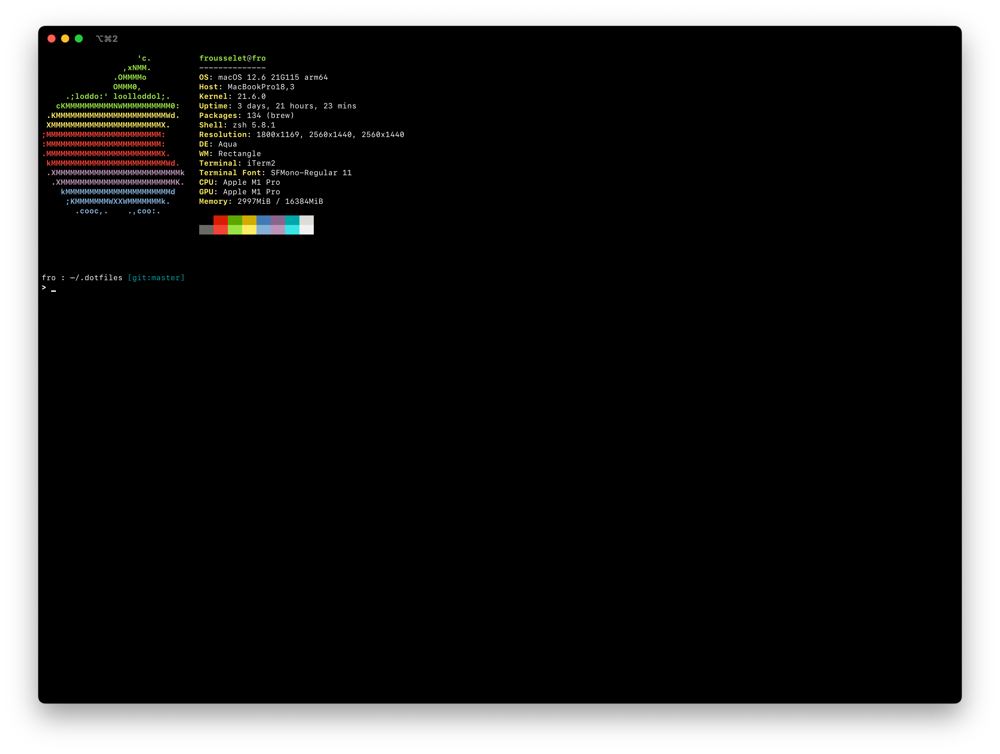

# Dotfiles



## Installation

With cURL:

```shell
curl -fsSL https://raw.github.com/frousselet/dotfiles/master/install.sh
```

With Wget:

```shell
wget https://raw.github.com/frousselet/dotfiles/master/install.sh -O -
```