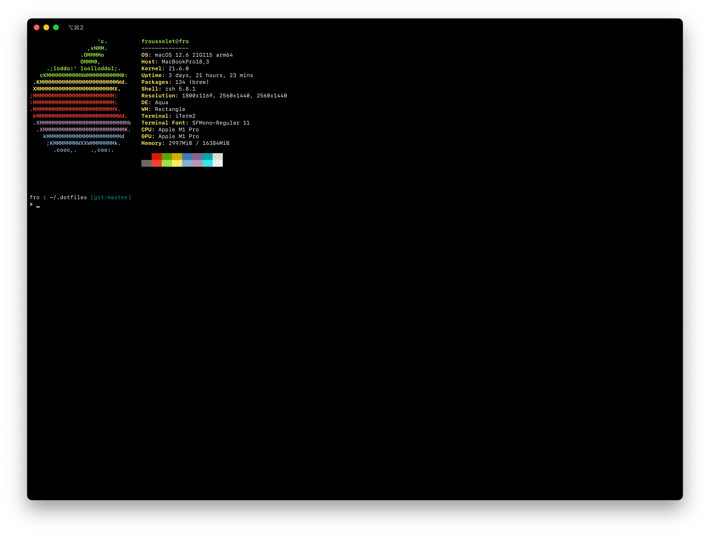

# Dotfiles



## Install

Works on macOS and Debian/Ubuntu Linux.

```bash
git clone https://github.com/frousselet/dotfiles.git ~/.dotfiles
cd ~/.dotfiles
./install.sh
```

The script is idempotent: run it again any time to update an existing
installation (Homebrew/apt packages, oh-my-zsh, zsh plugins, symlinks).

The repo must live at `~/.dotfiles` — the zsh config references that path.

## Customization

Drop machine-local snippets into `~/.zsh_extra/pre/*.zsh` (sourced first) or
`~/.zsh_extra/post/*.zsh` (sourced last). For example, to enable Nerd Font
prompt icons on a machine that has such a font installed:

```bash
echo 'export PROMPT_ICONS=1' > ~/.zsh_extra/post/icons.zsh
```
